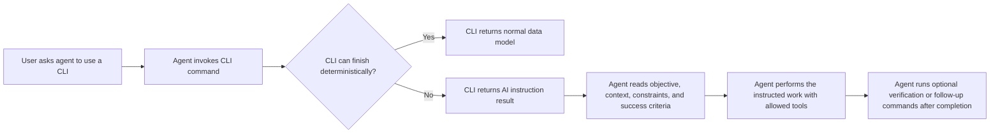

# AI Instruction Results

## Problem

The CLI tools are built around deterministic execution: each command gathers data, calls an API, drives browser automation, or invokes another CLI. Some workflows reach a point where the next action requires judgment that belongs to an AI agent, not to deterministic CLI code. Today there is no standard way for a CLI command to stop at that boundary and hand the next step back to Codex or Claude Code. This feature makes that handoff a first-class CLI result so every tool can expose non-deterministic work without embedding AI calls, free-form prose, or one-off conventions.

## Technical Plan

Add a shared AI instruction result contract to `cli-tools-shared`. Commands that reach an AI-only decision boundary will return a typed model with a fixed result type, schema version, objective, structured context, narrative context, allowed tool categories, constraints, and success criteria. The model can also include post-completion verification commands and follow-up commands, but those commands are explicitly downstream of the AI work and are not the required way to perform the handoff.

Generated CLI tools will get template-level support for returning these instruction results. Generated CLI skills will also learn the contract: when command stdout contains the AI instruction result type, the agent must follow the instruction object instead of treating it as ordinary command output. Codex and Claude Code skill copies must be updated together so the behavior stays in sync.

The CLI remains deterministic because it only identifies the handoff boundary and serializes a typed instruction object. The AI agent remains responsible for the non-deterministic judgment and for choosing the concrete tools needed to complete the instruction, within the constraints in the payload.

## Alternatives Considered

**Required commands inside the instruction result.** This seemed useful because it could give the agent an exact command to run next. It lost because the whole point of the feature is that the next step is not known deterministically by the CLI. Commands may exist after the AI work for verification or continuation, but they must not be the primary path for performing the instruction.

**The CLI calls an LLM directly.** This would make the command look self-contained to users. It lost because it would add model credentials, non-determinism, provider drift, and prompt behavior to every CLI tool. The existing CLI architecture is deterministic, and the AI runtime already exists outside the CLI.

**Plain-text instructions on stdout.** This is simple to emit but hard to validate and hard for agents to distinguish from normal human-readable output. It also conflicts with the data-only stdout convention. A typed JSON result keeps the behavior machine-readable and testable.

**A global agent-only convention with no CLI model.** The generated skills could tell agents to look for arbitrary instruction text. It lost because every CLI would invent a slightly different shape, and validators could not enforce first-class support.

## Detailed Implementation

**`<cli-tools-root>/_repo/cli-tools-shared/cli_tools_shared/models.py`** - modified
Rationale: Add shared Pydantic models for AI instruction results. The model should include a literal result type, schema version, tool name, command path, action identifier, objective, structured context, narrative context, allowed tool categories, constraints, success criteria, optional verification commands, optional follow-up commands, and optional metadata. The model should use the existing `CLIModel` base so it serializes consistently with other CLI outputs.

**`<cli-tools-root>/_repo/cli-tools-shared/cli_tools_shared/output.py`** - modified
Rationale: Add a shared output helper for AI instruction results that writes the typed model as JSON to stdout through the existing JSON serialization path. This keeps stdout data-only and avoids each CLI hand-rolling result serialization.

**`<cli-tools-root>/_repo/cli-tools-shared/cli_tools_shared/__init__.py`** - modified
Rationale: Export the AI instruction model and output helper from the shared package so generated CLIs can import them through the same public surface as other shared helpers.

**`<cli-tools-root>/_repo/cli-tools-shared/tests/test_ai_instruction_results.py`** - created
Rationale: Validate the shared model and output helper. Tests should cover required fields, JSON serialization, optional narrative and structured context, optional verification commands, optional follow-up commands, and the absence of any required-command field.

**`<cli-tools-root>/_repo/skills/cli-tool/templates/api/{{name}}_cli/output.py`** - modified
Rationale: Re-export the shared AI instruction output helper from API CLI templates so generated commands can use the standardized helper without new local formatting code.

**`<cli-tools-root>/_repo/skills/cli-tool/templates/api/{{name}}_cli/output.py`** - modified
Rationale: Mirror the API output helper re-export for Claude Code parity.

**`<cli-tools-root>/_repo/skills/cli-tool/templates/browser/{{name}}_cli/output.py`** - modified
Rationale: Re-export the shared AI instruction output helper from browser CLI templates for the same reason as API templates.

**`<cli-tools-root>/_repo/skills/cli-tool/templates/browser/{{name}}_cli/output.py`** - modified
Rationale: Mirror the browser output helper re-export for Claude Code parity.

**`<cli-tools-root>/_repo/skills/cli-tool/templates/wrapper/{{name}}_cli/output.py`** - modified
Rationale: Re-export the shared AI instruction output helper from wrapper CLI templates for the same reason as API templates.

**`<cli-tools-root>/_repo/skills/cli-tool/templates/wrapper/{{name}}_cli/output.py`** - modified
Rationale: Mirror the wrapper output helper re-export for Claude Code parity.

**`<cli-tools-root>/_repo/skills/cli-tool/templates/api/{{name}}_cli/models/ai_instruction.py`** - created
Rationale: Provide a generated-tool import location for the shared AI instruction model if the template model package is expected to expose all command result types locally. This file should not define a divergent schema; it should re-export the shared model.

**`<cli-tools-root>/_repo/skills/cli-tool/templates/api/{{name}}_cli/models/ai_instruction.py`** - created
Rationale: Mirror the API model re-export for Claude Code parity.

**`<cli-tools-root>/_repo/skills/cli-tool/templates/browser/{{name}}_cli/models/ai_instruction.py`** - created
Rationale: Same as the API template model file, scoped to browser tools.

**`<cli-tools-root>/_repo/skills/cli-tool/templates/browser/{{name}}_cli/models/ai_instruction.py`** - created
Rationale: Mirror the browser model re-export for Claude Code parity.

**`<cli-tools-root>/_repo/skills/cli-tool/templates/wrapper/{{name}}_cli/models/ai_instruction.py`** - created
Rationale: Same as the API template model file, scoped to wrapper tools.

**`<cli-tools-root>/_repo/skills/cli-tool/templates/wrapper/{{name}}_cli/models/ai_instruction.py`** - created
Rationale: Mirror the wrapper model re-export for Claude Code parity.

**`<cli-tools-root>/_repo/skills/cli-tool/templates/api/{{name}}_cli/models/__init__.py`** - modified
Rationale: Export `AIInstruction` from generated API model packages.

**`<cli-tools-root>/_repo/skills/cli-tool/templates/api/{{name}}_cli/models/__init__.py`** - modified
Rationale: Mirror the API model package export for Claude Code parity.

**`<cli-tools-root>/_repo/skills/cli-tool/templates/browser/{{name}}_cli/models/__init__.py`** - modified
Rationale: Export `AIInstruction` from generated browser model packages.

**`<cli-tools-root>/_repo/skills/cli-tool/templates/browser/{{name}}_cli/models/__init__.py`** - modified
Rationale: Mirror the browser model package export for Claude Code parity.

**`<cli-tools-root>/_repo/skills/cli-tool/templates/wrapper/{{name}}_cli/models/__init__.py`** - modified
Rationale: Export `AIInstruction` from generated wrapper model packages.

**`<cli-tools-root>/_repo/skills/cli-tool/templates/wrapper/{{name}}_cli/models/__init__.py`** - modified
Rationale: Mirror the wrapper model package export for Claude Code parity.

**`<cli-tools-root>/_repo/skills/cli-tool/references/output-standards.md`** - modified
Rationale: Document AI instruction results as stdout data, not stderr messaging. The reference should define when a command may return this result and should forbid required pre-action command lists in the instruction payload.

**`<cli-tools-root>/_repo/skills/cli-tool/references/output-standards.md`** - modified
Rationale: Mirror the output standard for Claude Code parity.

**`<cli-tools-root>/_repo/skills/cli-tool/references/model-standards.md`** - modified
Rationale: Document the shared AI instruction model as a first-class command result model. Clarify that command-specific instruction models must not fork the schema.

**`<cli-tools-root>/_repo/skills/cli-tool/references/model-standards.md`** - modified
Rationale: Mirror the model standard for Claude Code parity.

**`<cli-tools-root>/_repo/skills/cli-tool/references/templates.md`** - modified
Rationale: Add template guidance for commands that reach non-deterministic boundaries. The reference should explain that API, browser, and wrapper tools all use the same shared contract.

**`<cli-tools-root>/_repo/skills/cli-tool/references/templates.md`** - modified
Rationale: Mirror the template guidance for Claude Code parity.

**`<cli-tools-root>/_repo/skills/cli-tool/templates/api/README.md`** - modified
Rationale: Add author-facing documentation for returning AI instruction results from generated API CLIs.

**`<cli-tools-root>/_repo/skills/cli-tool/templates/api/README.md`** - modified
Rationale: Mirror the generated API README guidance for Claude Code parity.

**`<cli-tools-root>/_repo/skills/cli-tool/templates/browser/README.md`** - modified
Rationale: Add author-facing documentation for returning AI instruction results from generated browser CLIs.

**`<cli-tools-root>/_repo/skills/cli-tool/templates/browser/README.md`** - modified
Rationale: Mirror the generated browser README guidance for Claude Code parity.

**`<cli-tools-root>/_repo/skills/cli-tool/templates/wrapper/README.md`** - modified
Rationale: Add author-facing documentation for returning AI instruction results from generated wrapper CLIs.

**`<cli-tools-root>/_repo/skills/cli-tool/templates/wrapper/README.md`** - modified
Rationale: Mirror the generated wrapper README guidance for Claude Code parity.

**`<cli-tools-root>/_repo/skills/create-cli-tool-skill/templates/SKILL.md.template`** - modified
Rationale: Add the runtime rule generated CLI skills need: after every command, if stdout is an AI instruction result, the agent must perform the instruction instead of summarizing it as normal output. The rule should mention optional verification and follow-up commands only as post-completion actions.

**`<cli-tools-root>/_repo/skills/create-cli-tool-skill/templates/SKILL.md.template`** - modified
Rationale: Mirror the generated-skill template change for Claude Code parity. This must remain semantically equivalent to the Codex template while using Claude-native wording where needed.

**`<cli-tools-root>/_repo/skills/create-cli-tool-skill/SKILL.md`** - modified
Rationale: Document AI instruction result awareness as a core generated CLI skill standard.

**`<cli-tools-root>/_repo/skills/create-cli-tool-skill/SKILL.md`** - modified
Rationale: Mirror the generated CLI skill standard for Claude Code parity.

**`<cli-tools-root>/_repo/skills/create-cli-tool-skill/references/json-schema.md`** - modified
Rationale: Extend the `usage.json` guide with optional AI instruction metadata for leaf commands. The metadata should indicate that a command may return the AI instruction result type and should not imply a deterministic command path for performing the work.

**`<cli-tools-root>/_repo/skills/create-cli-tool-skill/references/json-schema.md`** - modified
Rationale: Mirror the schema-guide update for Claude Code parity.

**`<cli-tools-root>/_repo/skills/create-cli-tool-skill/scripts/validate-usage-json.sh`** - modified
Rationale: Validate the optional usage metadata when present. The validator should reject any metadata that reintroduces required pre-action command lists for AI instruction results.

**`<cli-tools-root>/_repo/skills/create-cli-tool-skill/scripts/validate-usage-json.sh`** - modified
Rationale: Mirror the validator change for Claude Code parity.

**`<cli-tools-root>/_repo/skills/cli-tool/SKILL.md`** - modified
Rationale: Add AI instruction results to the CLI-tool skill’s core standards and reference index so future CLI creation and update work treats the feature as first-class.

**`<cli-tools-root>/_repo/skills/cli-tool/SKILL.md`** - modified
Rationale: Mirror the CLI-tool skill standard for Claude Code parity.

**`<cli-tools-root>/_repo/skills/cli-tool/scripts/validate-cli-tool.sh`** - modified
Rationale: Add compliance checks for generated CLIs that expose AI instruction result examples or metadata. The validator should ensure they use the shared model/helper and do not create tool-local schemas.

**`<cli-tools-root>/_repo/skills/cli-tool/scripts/validate-cli-tool.sh`** - modified
Rationale: Mirror the CLI validator change for Claude Code parity if the Claude skill bundle carries the same script.

**`<cli-tools-root>/_repo/docs/designs/ai-instruction-results.md`** - created
Rationale: Store the design decisions, alternatives, and exact implementation file list as the durable source of truth for this feature.

Ordering constraints:

1. Add and test the shared `cli-tools-shared` model and output helper first.
2. Update templates to consume the shared helper after the shared package API exists.
3. Update generated-skill behavior and usage metadata after the result contract is finalized.
4. Apply Codex and Claude skill changes in the same operation.
5. Run unit tests for `cli-tools-shared`, then run the relevant CLI-tool skill validators and usage-json validators.
